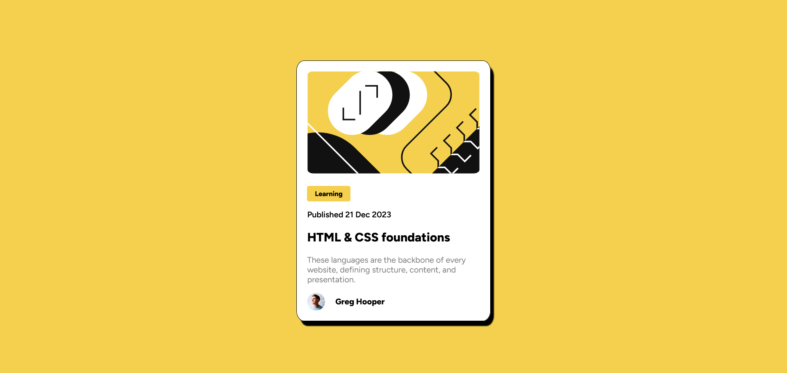
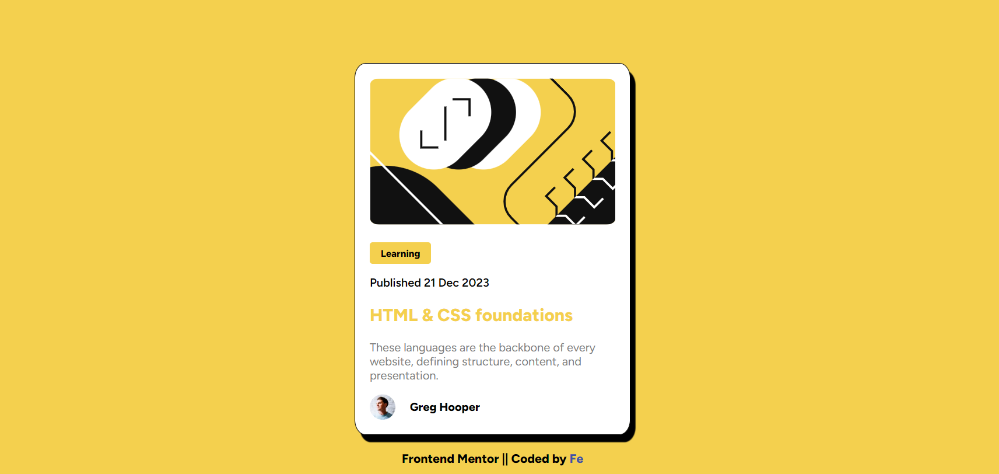

# Frontend Mentor - Blog preview card solution

This is a solution to the [Blog preview card challenge on Frontend Mentor](https://www.frontendmentor.io/challenges/blog-preview-card-ckPaj01IcS) Coded By [Fe](feyselteshome05@gmail.com).

## Table of contents

- [Overview](#overview)
  - [The challenge](#the-challenge)
  - [Screenshot](#screenshot)
  - [Links](#links)
- [My process](#my-process)
  - [Built with](#built-with)
  - [What I learned](#what-i-learned)
- [Author](#author)
- [Acknowledgments](#acknowledgments)

## Overview

### The challenge

Users should be able to:

- See hover and focus states for all interactive elements on the page

### Screenshot

#### Desktop Design

#### Active State

### Mobile Design

### Links

- Solution URL: [The Project](https://github.com/Code-Me-Well/Blog-preview-card-main)
- Live Site URL: [The Solution](https://code-me-well.github.io/Blog-preview-card-main/)

## My Process

### Built with

- Classic combo: HTML for the bones and CSS for the beauty.
- Flexbox
- CSS Grid
- Responsive layouts and smooth transition, all powered by HTML and CSS magic.

### What I learned

I didn't discover any new knowledge from this project, despite it being quite a journey. However, I encountered numerous struggles and challenges that I managed to overcome, and there are also some issues that I plan to address in the future.

## Author

- Frontend Mentor - [@Code-Me-Well](https://www.frontendmentor.io/profile/Code-Me-Well)
- Twitter - [@\_f_e_y_e](https://www.twitter.com/_f_e_y_e)

## Acknowledgments

In this project, I want to recognize my dedication. Hence, Excellent job [Fe](https://github.com/Code-Me-Well).
